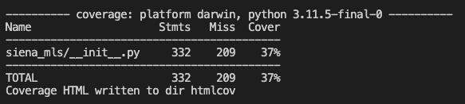

# Lab: Unit Testing and Code Coverage with JES Media Functions

## Objective

This lab aims to familiarize with the concepts and practices of unit testing and code coverage in Python, using the Siena MLS as a case study.

## Theoretical Background

### Unit Testing
Unit testing involves testing individual components or functions of a program to ensure they work as expected. Each test case is designed to test a specific part of the code in isolation.

### Code Coverage
Code coverage measures the amount of code exercised by a test suite. It helps in identifying untested parts of a codebase. There are different types of coverage, including:
- **Line Coverage**: Measures if each line of code has been executed.
- **Branch Coverage**: Measures if both the True and False branches of conditional statements have been executed.

### Tools
- `unittest` in Python: A unit testing framework. We will be running it via `pytest`
- `coverage.py`: A tool for measuring code coverage in Python. We will be using `py-cov` but again, should not matter at this stage `:)`

## Setup
1. Ensure Python is installed on your system.
2. Clone the `Siena_MLS` repository [https://github.com/Introduction-To-CS-Siena-College/Siena-MLS-py](https://github.com/Introduction-To-CS-Siena-College/Siena-MLS-py)
3. Change directory to the newly created directory
4. We need to learn on how to read ReadMe files in opensource projects, Follow the instructions listed in that project to Install depdendies, build the project and finally test.

- [ ] *Todo:* you should be able to run the command to test this project.
- [ ] *Do not remove these checkboxes! Add your answer below*

## Writing Unit Tests
Check the Example of a unit test for `makePicture` function:

```python
import unittest
from siena_mls import makePicture

class TestMakePicture(unittest.TestCase):
    def test_valid_image(self):
        picture = makePicture("tests/assets/siena-small-logo.png")
        self.assertIsNotNone(picture)

if __name__ == '__main__':
    unittest.main()

```

### Measuring Code Coverage

Many ways to measure coverage, or the proportion  of system being executed by the test suite.
One metric : *Line Coverage*
Covered lines, or exercised lines -> The lines that have atleast been executed by some test case in your test suite.
- LineCoverage_percentage = 100 * $covered \over {(covered + uncovered)} $

Another Metric : *Branch Coverage* \
We will see next semester, but can you research?

#### Text report
Check the auto generated report. 


#### HTML based report
Check the `htmlcov` directory and open the `index.html` 

#### Todo : Add the screenshot for makePicture
- [ ] Add the screenshot depicting the current coverage for
- [ ] What is the `line coverage` for the module?

<details>
<summary> Additional commands & comments</summary>
The basic commands to get code coverage are:

```bash
coverage run -m unittest discover
coverage report
```
These commands are usually automated in projects as you can see in the siena_mls project.


</details>

## Tasks
### Task 1: Analyse `makePicture`
Check the `makePicture` function inside the html report. Notice some part of this function is covered, while the other is not. Some are marked in green others in red.

Can you see what part of the function was not traveresed by the current testsuite and why this might be the case?
- [ ] *Todo* Add your answer here.

Any idea how you could go about writing a unit test for these uncovered ( marked in red ) lines? Atleast specify a simple test case defination, input & output.
- [ ] *Todo* Add your answer here.

### Task 2: Mocked tests
The idea of mocking or making fake objects is very common in testing. Look at the file `test_makePicture_using_mock.py`. What do you see? 
Guess what this is doing... 

- [ ] Your answer goes here.

--- 
Make a copy of this file, name it `test_makePicture_using_mock_700.py` where you create an image of 700 height by 700 width. 
#### Note the change
Now run the command to test this project again, do you see any change? How has the coverage changed?

- [ ] *Todo* Do you see any change in output?
- [ ] *Todo* Has the coverage changed?
- [ ] *ToDo* attach the new screenshot.
- [ ] **GUESS** Why this test case failed ?

please note, i do not expect correct answers here. It maybe great for your spend some time ont this, but give your best shot.

### Task 3: Write Unit Tests
Without using Generative models, Write unit tests for the following functions in JES Media Functions:
1. `duplicatePicture`
2. `makeSound`
3. (optional)`getSampleValueAt` and `setSampleValueAt`
Modify the tests we have already seen to accomplish this. Feel free to create new test files if that's your fancy! but the idea is to get these functions tested.
### Task 2: Measure Code Coverage
After writing the unit tests, use `coverage.py` to measure the code coverage of your tests.

#### Todo : Add the screenshot for makePicture
- [ ] Add the screenshot depicting the current coverage for
- [ ] What is the `line coverage` for the module?


## Submission
Finish all the ToDos in this document 
Submit the following:
1. Your unit test code.
2. A screenshot or text file of the coverage report.
3. A brief reflection on what parts of the code were difficult to test and why. How will you select what to test!?

## Additional Resources
- Python `unittest` documentation: [https://docs.python.org/3/library/unittest.html](https://docs.python.org/3/library/unittest.html)
- Coverage.py documentation: [https://coverage.readthedocs.io/](https://coverage.readthedocs.io/)
- [UBC.ca - Lecture 4 Debugging...](https://ubc-mds.github.io/DSCI_524_collab-sw-dev/materials/lectures/04_lecture-debugging-and-docs.html)
